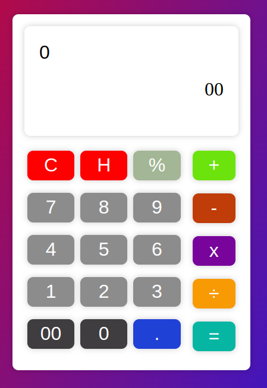

# Calculator

# Calculator

A simple calculator application built with Html,CSS and JavaScript.

## Table of Contents

- [Introduction](#introduction)
- [Features](#features)

## Introduction

Welcome to the Calculator project! This application is designed to perform basic mathematical operations such as addition, subtraction, multiplication, and division. It provides a user-friendly interface for performing calculations quickly and accurately.

## Features

- Addition: Add two or more numbers together.
- Subtraction: Subtract one number from another.
- Multiplication: Multiply two or more numbers together.
- Division: Divide one number by another.
- Error Handling: Gracefully handle invalid inputs and display appropriate error messages.
- User Interface: Simple and intuitive interface for easy interaction.

